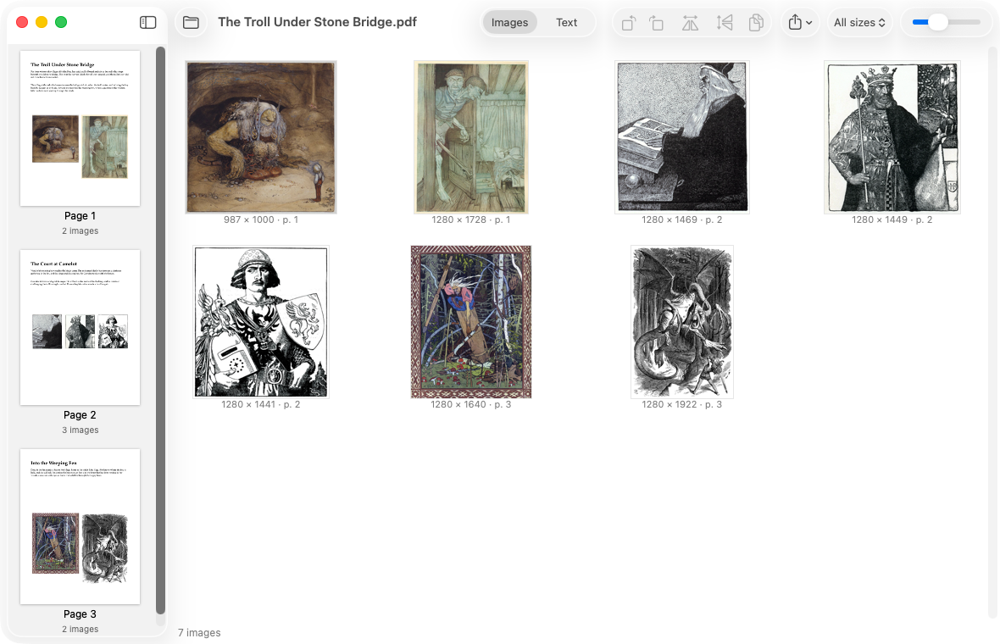

# Pluck

[](https://github.com/scooper4711/pluck/actions/workflows/ci.yml)
[](https://sonarcloud.io/summary/new_code?id=scooper4711_pluck)
[](https://sonarcloud.io/summary/new_code?id=scooper4711_pluck)
[](https://github.com/scooper4711/pluck/releases)
[](https://github.com/scooper4711/pluck/releases)
[](#requirements)
[](./LICENSE)


A Mac app that opens a PDF and offers up every image inside it, and its text too.

Getting a picture out of a PDF usually means a screenshot: the wrong size, a background where it should be
transparent, and a page edge cutting it off. Pluck reads the images the PDF actually contains, at their own
resolution and with their transparency, so a creature's art from an adventure comes out as the creature
alone, ready for a token, a custom pawn in [Pawn Shop](https://github.com/scooper4711/pawn-shop) or a
virtual tabletop. It also reads the text in reading order, and turns Pathfinder stat blocks into data other
apps can use.

It is free, and it works with any PDF you open; it contains no content of its own.



*A three-page sample adventure opened in Pluck: every illustration at its own resolution, with the page it
is on. The art is public domain (see [Sample art](#sample-art)).*

## Features

- **Page navigator:** thumbnails of every page down the left. Select one or more pages to see only their
  images; select none to see them all.
- **Real images:** extracted at their native resolution with transparency intact (soft masks, stencil masks,
  color-key masks), not re-rendered.
- **No duplicates:** an image repeated across pages (borders, backgrounds) is shown once, labeled with how
  many pages use it.
- **Text too:** switch the main view to Text (⌘2) for the selected pages' text in reading order: columns
  untangled, info boxes and read-aloud passages set apart, each paragraph on one line, bold and italic kept.
  Plain text, Markdown or HTML; select and copy, Copy All, or export. HTML is shown rendered but copies as
  markup.
- **Pathfinder stat blocks:** recognized and written as
  [Fantasy Statblocks](https://github.com/javalent/fantasy-statblocks) YAML in Markdown, and as structured
  HTML.
- **Stat blocks for other apps:** the stat blocks on the shown pages are listed above the text: click one to
  copy it, drag it out, or Copy All Stat Blocks (⌥⌘C). Apps that read Pluck's stat block format get the
  structured block; rich-text apps such as Pages and Mail get it with bold labels, and every other app
  gets plain text.
- **Several PDFs at once:** each in its own window, with File › Open Recent.
- **See it in context:** right-click an image and choose Show Page in Sidebar to scroll the navigator to the
  page it is on, without changing which pages are selected.
- **Multi-select:** click, ⌘-click or ⇧-click, drag a selection rectangle, or press ⌘A.
- **Rotate and flip:** ⌘L and ⌘R and the Image menu; edits carry through to whatever leaves the app.
- **Get them out:** ⌘C copies (PNG and TIFF), dragging to Finder drops `.webp` files, and ⌘E or ⇧⌘E exports
  the selection or everything shown as WebP.
- **Settings** (⌘,): WebP quality, or lossless.
- **Updates:** Pluck tells you when a new version is released, if you like: it checks when it opens (turn that
  off in Settings) and on Pluck › Check for Updates….

## Requirements

macOS 15 or later.

## Installing a release

Download the disk image from the [releases page](https://github.com/scooper4711/pluck/releases), open it and
drag Pluck to Applications.

The app is not notarized by Apple, so macOS blocks it the first time:

1. Open Pluck once. macOS says it cannot be opened; click Done.
2. Open System Settings › Privacy & Security and scroll down to the message about Pluck.
3. Click Open Anyway and confirm.

After that it opens normally.

## Society Toolkit

Pluck is part of the Society Toolkit, free Mac apps for Pathfinder and Starfinder players and GMs. Like
the toolkits in the game, each one grants a +1 item bonus to game prep.

- [Scrollkeeper](https://github.com/scooper4711/scrollkeeper) keeps your Paizo library in order and
  downloads your purchases.
- **Pluck** gets the art, text and stat blocks out of a PDF.
- [Pawn Shop](https://github.com/scooper4711/pawn-shop) prints just the pawns you need, single-sided, from
  your pawn PDFs.
- [Mapsmith](https://github.com/scooper4711/mapsmith) prints battle maps at true scale on ordinary paper.

## Supporting the project

The app is free and always will be. If it saves you time and you would like to say thanks, you can leave a
tip on [Ko-fi](https://ko-fi.com/coop207627). A donation is entirely optional and unlocks nothing.

## Building

```sh
make app      # builds dist/Pluck.app
make run      # builds and launches the app
make install  # builds the app and moves it to /Applications
make test     # runs the unit tests
make lint     # runs SwiftLint
make coverage # runs the tests and enforces the coverage threshold
make dmg      # packages the app into a disk image
make icon     # redraws Resources/AppIcon.icns
```

Building needs Xcode 16 or later (Swift 6 toolchain). The app is ad-hoc signed. `swift run Pluck` runs it
unbundled for development.

The tests write their own PDFs object by object (`Tests/PluckKitTests/Support/PDFBuilder.swift`), so every
color space, mask type and nesting case is exercised deterministically.

The code is in two parts:

- `Sources/PluckKit`: extraction, de-duplication, edits, encoding, export and the `PluckModel`; unit tested.
- `Sources/Pluck`: the SwiftUI and AppKit app.

## Documentation

The requirements and design, with known limits, are in [`docs/specs`](docs/specs): one for images and one
for text.

## Regarding the use of AI

I used AI as a coding assistant while building this. I'm a software engineer with decades of professional
experience. I could have written every line myself, but AI let me move faster. I drove the architecture and
design decisions, followed industry best practices for code quality, and made sure everything is
human-readable and maintainable. The project has SonarCloud quality gates and a full test suite that must pass
before any release.

Think of it like driving a car instead of walking. I plan the route, decide the stops along the way, and AI
gets me to the destination faster than I could on foot. But I'm still the one behind the wheel.

If you don't want to use tools written with AI assistance, then I respect that decision. That's why I'm
transparent about it. You can make up your own mind.

## Sample art

The sample PDF in the screenshot was made for this README. Its text is original, and its illustrations are
public domain, from Wikimedia Commons:

- Merlin, King Arthur and Sir Gawaine: Howard Pyle, *The Story of King Arthur and His Knights* (1903)
  ([1](https://commons.wikimedia.org/wiki/File:Arthur-Pyle_The_Enchanter_Merlin.JPG),
  [2](https://commons.wikimedia.org/wiki/File:Arthur-Pyle_King_Arthur_of_Britain.JPG),
  [3](https://commons.wikimedia.org/wiki/File:Arthur-Pyle_Sir_Gawaine_the_Son_of_Lot,_King_of_Orkney.JPG))
- Baba Yaga: Ivan Bilibin, 1900
  ([source](https://commons.wikimedia.org/wiki/File:Bilibin._Baba_Yaga.jpg))
- Jabberwock: John Tenniel, *Through the Looking-Glass* (1871)
  ([source](https://commons.wikimedia.org/wiki/File:Jabberwocky.jpg))
- Cave Troll: John Bauer, *Bland tomtar och troll* (1912), Nationalmuseum, Stockholm
  ([source](https://commons.wikimedia.org/wiki/File:John_Bauer_-_%22Ho,_What_a_Pipsqueak%5E_Said_the_Troll%22,_Bland_tomtar_och_troll,_1912_-_NMH_118-1982_-_Nationalmuseum.jpg))
- Welsh Giant: Arthur Rackham, *The Allies' Fairy Book* (1916)
  ([source](https://commons.wikimedia.org/wiki/File:At_the_dead_time_of_the_night_in_came_the_Welsh_Giant.jpg))

## License

Pluck is released under the [MIT license](LICENSE). It encodes WebP with Google's
[libwebp](https://chromium.googlesource.com/webm/libwebp), under its BSD license, through
[libwebp-Xcode](https://github.com/SDWebImage/libwebp-Xcode).

## Trademarks

Pathfinder is a trademark of Paizo Inc. Pluck is an independent project. It is not published, endorsed, or
specifically approved by Paizo, and it contains no Paizo content.
